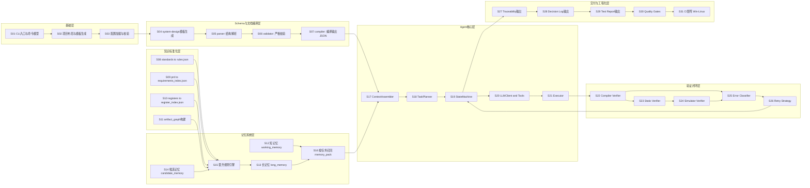

# EPI 开发切片总览（架构大图 + 任务切片）

> 目标：给出 EPI 本体开发的完整切片视图，支持整体评估与逐切片风险分析。

## 1. 总体开发大图（EPI 本体，不是 FW 业务架构）

---

## 2. 开发切片清单（WBS）

| Slice | 名称 | 目标产物 | 主要依赖 | 验收标准（DoD） |
|---|---|---|---|---|
| S01 | CLI入口与命令模型 | `epi` 命令入口 | - | `epi /path`、`--schema-compile`、`--reset-schema-template` 可用 |
| S02 | 项目布局与模板生成 | Docs 目录树 + 模板文件 | S01 | 一键补齐目录；`--check-only` 正确报告 |
| S03 | 配置加载与校验 | `config` 模块 | S02 | config 缺失/非法时给出明确错误 |
| S04 | system-design 模板生成 | 标准 markdown 模板 | S02 | 重置后模板稳定可复现 |
| S05 | parser | section/kv/table/mermaid 解析 | S04 | 能稳定解析固定结构 |
| S06 | validator | 严格规则校验 | S05 | section/表头不符即 fail |
| S07 | compiler | 编译输出 JSON | S06 | 输出 deterministic JSON |
| S08 | standards ingestion | `knowledge/rules.json` | S02 | 规则具备 source_id/source_path |
| S09 | prd ingestion | `requirements_index.json` | S02 | 需求具备 req_id/source |
| S10 | registers ingestion | `register_index.json` | S02 | 寄存器条目可检索 |
| S11 | artifact_graph | `artifact_graph.json` | S09 | 可计算跨模块影响节点数 |
| S12 | 短记忆 | `working_memory.json` | S17 | 每步刷新、体量受控 |
| S13 | 长记忆 | `long_memory.json` | S12 | decisions/constraints/traceability 三类齐全 |
| S14 | 候选记忆 | `candidate_memory.json` | S13 | 记录 LLM 提名候选 |
| S15 | 晋升规则引擎 | promotion 模块 | S08~S11,S14 | 无白名单 source_id 不晋升 |
| S16 | 召回策略 | memory pack | S13,S15 | 按 task 返回最小记忆包 |
| S17 | ContextAssembler | 上下文组装器 | S12,S16 | token 控量，按层注入 |
| S18 | TaskPlanner | 任务列表生成 | S03 | PRD->任务有序可执行 |
| S19 | StateMachine | 主循环与状态流转 | S18 | phase/task/retry 行为可预测 |
| S20 | LLMClient+Tools | 模型与工具调用 | S19 | provider 可替换 |
| S21 | Executor | 文件与动作执行 | S19 | 写入动作可审计 |
| S22 | Compiler Verifier | 编译验证 | S21 | fail 输出结构化错误 |
| S23 | Static Verifier | 静态分析 | S22 | 规则告警可结构化 |
| S24 | Simulator Verifier | 仿真验证 | S22 | timeout/crash 可识别 |
| S25 | Error Classifier | 错误分类器 | S22~S24 | 分类准确映射恢复策略 |
| S26 | Retry Strategy | 重试策略引擎 | S25 | 错误类型对应差异化重试 |
| S27 | Traceability 输出 | traceability 文档 | S19 | req->code->test 全链路 |
| S28 | Decision Log 输出 | design_decisions 文档 | S13 | 每个关键决策可追溯 |
| S29 | Test Report 输出 | test_report 文档 | S22~S24 | 验证结果汇总完整 |
| S30 | Quality Gates | 门禁策略 | S27~S29 | gate fail 阻断后续阶段 |
| S31 | CI矩阵 | Win/Linux CI | S30 | 双平台流水线稳定 |

---

## 3. 关键边界（防跑偏）

1. **FW Architecture ≠ EPI Development Architecture**
   - FW 架构图是业务输出。
   - 本文是 EPI 自身开发任务图。

2. **driver 初始化边界**
   - 不属于 `fw-architecture` 描述域。
   - 唯一来源：`Docs/ai-generation/register-init/*`。

3. **语义不做最终裁决**
   - LLM 可提名，不可直接晋升长记忆。
   - 最终由规则引擎按结构化证据判定。
