# EPI 开发切片总览（架构大图 + 任务切片）

> 目标：给出 EPI 本体开发的完整切片视图，支持整体评估与逐切片风险分析。

## 1. 总体开发大图（EPI 本体，不是 FW 业务架构）

```mermaid
flowchart LR

  subgraph Inputs[外部输入]
    IN_PRD[PRD]
    IN_BSP[BSP]
    IN_HW[HW: SCH/DATASHEET/REGS/PIN_MAP]
    IN_STD[STANDARDS]
    IN_TOOL[TOOLCHAIN/ENV]
  end

  subgraph Foundation[基础层]
    S01[S01 CLI入口]
    S02[S02 布局/模板]
    S03[S03 配置校验]
  end

  subgraph Schema[Schema/编译层]
    S04[S04 SD模板生成]
    S05[S05 parser]
    S06[S06 validator]
    S07[S07 compiler]
  end

  subgraph Knowledge[知识层]
    S08[S08 STANDARDS]
    S09[S09 PRD]
    S10[S10 REGS]
    S11[S11 artifact_graph]
  end

  subgraph Memory[记忆层]
    S12[S12 短记忆]
    S13[S13 长记忆]
    S14[S14 候选记忆]
    S15[S15 晋升规则]
    S16[S16 任务召回]
  end

  subgraph AgentCore[核心层]
    S17[S17 Context]
    S18[S18 Planner]
    S19[S19 State]
    S20[S20 LLM/Tools]
    S21[S21 Executor]
  end

  subgraph Verify[验证层]
    S22[S22 编译验证]
    S23[S23 静态验证]
    S24[S24 仿真验证]
    S25[S25 错误分类]
    S26[S26 重试策略]
  end

  subgraph Delivery[交付层]
    S27[S27 Traceability]
    S28[S28 Decision Log]
    S29[S29 Test Report]
    S30[S30 Quality Gates]
    S31[S31 CI矩阵]
  end

  %% 开发依赖（实线）
  S01 -->|CLI契约| S02
  S02 -->|config.yaml| S03
  S02 -->|模板骨架| S04
  S04 -->|system-design.md| S05
  S05 -->|sections| S06
  S06 -->|schema| S07

  S02 -->|STANDARDS入口| S08
  S02 -->|PRD入口| S09
  S02 -->|REGS入口| S10
  S09 -->|req节点| S11
  S10 -->|reg节点| S11

  S12 -->|片段| S13
  S13 -->|约束/决策| S14
  S08 -->|rules| S15
  S09 -->|req_index| S15
  S10 -->|reg_index| S15
  S11 -->|artifact_graph| S15
  S14 -->|candidate| S15
  S13 -->|long base| S16
  S15 -->|promotion| S16
  S12 -->|working| S17
  S16 -->|pack| S17


  S03 -->|配置| S18
  S18 -->|任务序列| S19
  S19 -->|phase/task| S20
  S19 -->|调度| S21
  S21 -->|产物| S22
  S22 -->|编译结果| S23
  S22 -->|工件| S24
  S22 -->|错误流| S25
  S23 -->|静态告警| S25
  S24 -->|仿真结果| S25
  S25 -->|分类标签| S26

  S19 -->|追踪| S27
  S13 -->|决策| S28
  S22 -->|编译| S29
  S23 -->|静态| S29
  S24 -->|仿真| S29
  S27 -->|证据| S30
  S28 -->|证据| S30
  S29 -->|证据| S30
  S30 -->|判定| S31

  %% 运行时依赖（虚线，橙色）
  S17 -.->|上一轮上下文回写| S12
  S15 -.->|晋升写入事件| S13
  S20 -.->|LLM候选提名| S14
  S14 -.->|候选待裁决队列| S15
  S19 -.->|当前task查询| S16
  S19 -.->|当前phase/task| S17
  S17 -.->|上下文输入| S18
  S26 -.->|重试反馈| S19
  S17 -.->|context pack| S20
  S20 -.->|工具调用计划| S21
  S21 -.->|执行产物流| S22
  S22 -.->|编译信号| S23
  S22 -.->|编译信号| S24
  S22 -.->|编译信号| S25
  S23 -.->|静态信号| S25
  S24 -.->|仿真信号| S25
  S25 -.->|分类结果流| S26
  S21 -.->|执行记录| S27
  S22 -.->|编译记录| S27
  S23 -.->|静态记录| S27
  S24 -.->|仿真记录| S27
  S19 -.->|状态转移事件| S28
  S22 -.->|编译结果流| S29
  S23 -.->|静态结果流| S29
  S24 -.->|仿真结果流| S29
  S29 -.->|实时门禁输入| S30
  S30 -.->|门禁结果输入| S31

  IN_TOOL -->|env| S03
  IN_PRD -->|约束| S04
  IN_BSP -->|边界| S04
  IN_HW -->|硬件| S04
  IN_STD -->|标准| S04
  IN_STD -->|source| S08
  IN_PRD -->|source| S09
  IN_HW -->|source| S10
  IN_PRD -->|req| S11
  IN_HW -->|reg| S11
  IN_PRD -->|task语义| S18
  IN_TOOL -->|仿真环境| S24
  IN_TOOL -->|CI环境| S31

  %% 样式：实线=开发依赖；虚线=运行时依赖
  linkStyle default stroke:#2563EB,stroke-width:2.2px
  linkStyle 0 stroke:#2563EB,stroke-width:2.2px
  linkStyle 1 stroke:#2563EB,stroke-width:2.2px
  linkStyle 2 stroke:#2563EB,stroke-width:2.2px
  linkStyle 3 stroke:#2563EB,stroke-width:2.2px
  linkStyle 4 stroke:#2563EB,stroke-width:2.2px
  linkStyle 5 stroke:#2563EB,stroke-width:2.2px
  linkStyle 6 stroke:#2563EB,stroke-width:2.2px
  linkStyle 7 stroke:#2563EB,stroke-width:2.2px
  linkStyle 8 stroke:#2563EB,stroke-width:2.2px
  linkStyle 9 stroke:#2563EB,stroke-width:2.2px
  linkStyle 10 stroke:#2563EB,stroke-width:2.2px
  linkStyle 11 stroke:#2563EB,stroke-width:2.2px
  linkStyle 12 stroke:#2563EB,stroke-width:2.2px
  linkStyle 13 stroke:#2563EB,stroke-width:2.2px
  linkStyle 14 stroke:#2563EB,stroke-width:2.2px
  linkStyle 15 stroke:#2563EB,stroke-width:2.2px
  linkStyle 16 stroke:#2563EB,stroke-width:2.2px
  linkStyle 17 stroke:#2563EB,stroke-width:2.2px
  linkStyle 18 stroke:#2563EB,stroke-width:2.2px
  linkStyle 19 stroke:#2563EB,stroke-width:2.2px
  linkStyle 20 stroke:#2563EB,stroke-width:2.2px
  linkStyle 21 stroke:#2563EB,stroke-width:2.2px
  linkStyle 22 stroke:#2563EB,stroke-width:2.2px
  linkStyle 23 stroke:#2563EB,stroke-width:2.2px
  linkStyle 24 stroke:#2563EB,stroke-width:2.2px
  linkStyle 25 stroke:#2563EB,stroke-width:2.2px
  linkStyle 26 stroke:#2563EB,stroke-width:2.2px
  linkStyle 27 stroke:#2563EB,stroke-width:2.2px
  linkStyle 28 stroke:#2563EB,stroke-width:2.2px
  linkStyle 29 stroke:#2563EB,stroke-width:2.2px
  linkStyle 30 stroke:#2563EB,stroke-width:2.2px
  linkStyle 31 stroke:#2563EB,stroke-width:2.2px
  linkStyle 32 stroke:#2563EB,stroke-width:2.2px
  linkStyle 33 stroke:#2563EB,stroke-width:2.2px
  linkStyle 34 stroke:#2563EB,stroke-width:2.2px
  linkStyle 35 stroke:#2563EB,stroke-width:2.2px
  linkStyle 36 stroke:#2563EB,stroke-width:2.2px
  linkStyle 37 stroke:#2563EB,stroke-width:2.2px
  linkStyle 38 stroke:#2563EB,stroke-width:2.2px
  linkStyle 39 stroke:#2563EB,stroke-width:2.2px
  linkStyle 40 stroke:#2563EB,stroke-width:2.2px
  linkStyle 41 stroke:#2563EB,stroke-width:2.2px
  linkStyle 42 stroke:#F97316,stroke-width:2.2px,stroke-dasharray:7 5
  linkStyle 43 stroke:#F97316,stroke-width:2.2px,stroke-dasharray:7 5
  linkStyle 44 stroke:#F97316,stroke-width:2.2px,stroke-dasharray:7 5
  linkStyle 45 stroke:#F97316,stroke-width:2.2px,stroke-dasharray:7 5
  linkStyle 46 stroke:#F97316,stroke-width:2.2px,stroke-dasharray:7 5
  linkStyle 47 stroke:#F97316,stroke-width:2.2px,stroke-dasharray:7 5
  linkStyle 48 stroke:#F97316,stroke-width:2.2px,stroke-dasharray:7 5
  linkStyle 49 stroke:#F97316,stroke-width:2.2px,stroke-dasharray:7 5
  linkStyle 50 stroke:#F97316,stroke-width:2.2px,stroke-dasharray:7 5
  linkStyle 51 stroke:#F97316,stroke-width:2.2px,stroke-dasharray:7 5
  linkStyle 52 stroke:#F97316,stroke-width:2.2px,stroke-dasharray:7 5
  linkStyle 53 stroke:#F97316,stroke-width:2.2px,stroke-dasharray:7 5
  linkStyle 54 stroke:#F97316,stroke-width:2.2px,stroke-dasharray:7 5
  linkStyle 55 stroke:#F97316,stroke-width:2.2px,stroke-dasharray:7 5
  linkStyle 56 stroke:#F97316,stroke-width:2.2px,stroke-dasharray:7 5
  linkStyle 57 stroke:#F97316,stroke-width:2.2px,stroke-dasharray:7 5
  linkStyle 58 stroke:#F97316,stroke-width:2.2px,stroke-dasharray:7 5
  linkStyle 59 stroke:#F97316,stroke-width:2.2px,stroke-dasharray:7 5
  linkStyle 60 stroke:#F97316,stroke-width:2.2px,stroke-dasharray:7 5
  linkStyle 61 stroke:#F97316,stroke-width:2.2px,stroke-dasharray:7 5
  linkStyle 62 stroke:#F97316,stroke-width:2.2px,stroke-dasharray:7 5
  linkStyle 63 stroke:#F97316,stroke-width:2.2px,stroke-dasharray:7 5
  linkStyle 64 stroke:#F97316,stroke-width:2.2px,stroke-dasharray:7 5
  linkStyle 65 stroke:#F97316,stroke-width:2.2px,stroke-dasharray:7 5
  linkStyle 66 stroke:#F97316,stroke-width:2.2px,stroke-dasharray:7 5
  linkStyle 67 stroke:#F97316,stroke-width:2.2px,stroke-dasharray:7 5
  linkStyle 68 stroke:#F97316,stroke-width:2.2px,stroke-dasharray:7 5
  linkStyle 18 stroke:#F97316,stroke-width:2.2px,stroke-dasharray:7 5
  linkStyle 19 stroke:#F97316,stroke-width:2.2px,stroke-dasharray:7 5
  linkStyle 20 stroke:#F97316,stroke-width:2.2px,stroke-dasharray:7 5
  linkStyle 21 stroke:#F97316,stroke-width:2.2px,stroke-dasharray:7 5
  linkStyle 22 stroke:#F97316,stroke-width:2.2px,stroke-dasharray:7 5
  linkStyle 23 stroke:#F97316,stroke-width:2.2px,stroke-dasharray:7 5
  linkStyle 24 stroke:#F97316,stroke-width:2.2px,stroke-dasharray:7 5
  linkStyle 25 stroke:#F97316,stroke-width:2.2px,stroke-dasharray:7 5
  linkStyle 26 stroke:#F97316,stroke-width:2.2px,stroke-dasharray:7 5
  linkStyle 27 stroke:#F97316,stroke-width:2.2px,stroke-dasharray:7 5
  linkStyle 28 stroke:#F97316,stroke-width:2.2px,stroke-dasharray:7 5
  linkStyle 29 stroke:#F97316,stroke-width:2.2px,stroke-dasharray:7 5
  linkStyle 30 stroke:#F97316,stroke-width:2.2px,stroke-dasharray:7 5
  linkStyle 31 stroke:#F97316,stroke-width:2.2px,stroke-dasharray:7 5
  linkStyle 32 stroke:#F97316,stroke-width:2.2px,stroke-dasharray:7 5
  linkStyle 33 stroke:#F97316,stroke-width:2.2px,stroke-dasharray:7 5
  linkStyle 34 stroke:#F97316,stroke-width:2.2px,stroke-dasharray:7 5
  linkStyle 35 stroke:#F97316,stroke-width:2.2px,stroke-dasharray:7 5
  linkStyle 36 stroke:#F97316,stroke-width:2.2px,stroke-dasharray:7 5
  linkStyle 37 stroke:#F97316,stroke-width:2.2px,stroke-dasharray:7 5
  linkStyle 38 stroke:#F97316,stroke-width:2.2px,stroke-dasharray:7 5
  linkStyle 39 stroke:#F97316,stroke-width:2.2px,stroke-dasharray:7 5
  linkStyle 40 stroke:#F97316,stroke-width:2.2px,stroke-dasharray:7 5
  linkStyle 41 stroke:#F97316,stroke-width:2.2px,stroke-dasharray:7 5
  linkStyle 43 stroke:#F97316,stroke-width:2.2px,stroke-dasharray:7 5
  linkStyle 44 stroke:#F97316,stroke-width:2.2px,stroke-dasharray:7 5
  linkStyle 45 stroke:#F97316,stroke-width:2.2px,stroke-dasharray:7 5
  linkStyle 46 stroke:#F97316,stroke-width:2.2px,stroke-dasharray:7 5
  linkStyle 47 stroke:#F97316,stroke-width:2.2px,stroke-dasharray:7 5
  linkStyle 48 stroke:#F97316,stroke-width:2.2px,stroke-dasharray:7 5
  linkStyle 49 stroke:#F97316,stroke-width:2.2px,stroke-dasharray:7 5
  linkStyle 50 stroke:#F97316,stroke-width:2.2px,stroke-dasharray:7 5
  linkStyle 51 stroke:#F97316,stroke-width:2.2px,stroke-dasharray:7 5
  linkStyle 52 stroke:#F97316,stroke-width:2.2px,stroke-dasharray:7 5
  linkStyle 53 stroke:#F97316,stroke-width:2.2px,stroke-dasharray:7 5
  linkStyle 54 stroke:#F97316,stroke-width:2.2px,stroke-dasharray:7 5
  linkStyle 55 stroke:#F97316,stroke-width:2.2px,stroke-dasharray:7 5
  linkStyle 56 stroke:#F97316,stroke-width:2.2px,stroke-dasharray:7 5
  linkStyle 57 stroke:#F97316,stroke-width:2.2px,stroke-dasharray:7 5
  linkStyle 58 stroke:#F97316,stroke-width:2.2px,stroke-dasharray:7 5
  linkStyle 59 stroke:#F97316,stroke-width:2.2px,stroke-dasharray:7 5
  linkStyle 60 stroke:#F97316,stroke-width:2.2px,stroke-dasharray:7 5
  linkStyle 61 stroke:#F97316,stroke-width:2.2px,stroke-dasharray:7 5
  linkStyle 62 stroke:#F97316,stroke-width:2.2px,stroke-dasharray:7 5
  linkStyle 63 stroke:#F97316,stroke-width:2.2px,stroke-dasharray:7 5
  linkStyle 64 stroke:#F97316,stroke-width:2.2px,stroke-dasharray:7 5
  linkStyle 65 stroke:#F97316,stroke-width:2.2px,stroke-dasharray:7 5
  linkStyle 66 stroke:#F97316,stroke-width:2.2px,stroke-dasharray:7 5
  linkStyle 67 stroke:#F97316,stroke-width:2.2px,stroke-dasharray:7 5
  linkStyle 68 stroke:#F97316,stroke-width:2.2px,stroke-dasharray:7 5
  linkStyle 69 stroke:#F97316,stroke-width:2.2px,stroke-dasharray:7 5
  linkStyle 70 stroke:#F97316,stroke-width:2.2px,stroke-dasharray:7 5
  linkStyle 71 stroke:#F97316,stroke-width:2.2px,stroke-dasharray:7 5
  linkStyle 72 stroke:#F97316,stroke-width:2.2px,stroke-dasharray:7 5
  linkStyle 73 stroke:#F97316,stroke-width:2.2px,stroke-dasharray:7 5
  linkStyle 74 stroke:#F97316,stroke-width:2.2px,stroke-dasharray:7 5
  linkStyle 75 stroke:#F97316,stroke-width:2.2px,stroke-dasharray:7 5
  linkStyle 76 stroke:#F97316,stroke-width:2.2px,stroke-dasharray:7 5
  linkStyle 77 stroke:#F97316,stroke-width:2.2px,stroke-dasharray:7 5
  linkStyle 78 stroke:#F97316,stroke-width:2.2px,stroke-dasharray:7 5
  linkStyle 79 stroke:#F97316,stroke-width:2.2px,stroke-dasharray:7 5
  linkStyle 80 stroke:#F97316,stroke-width:2.2px,stroke-dasharray:7 5
  linkStyle 81 stroke:#F97316,stroke-width:2.2px,stroke-dasharray:7 5
```

---

## 2. 开发切片清单（WBS）

| Slice | 名称 | 目标产物 | 开发依赖 | 运行时依赖 | 验收标准（DoD） |
|---|---|---|---|---|---|
| S01 | CLI入口与命令模型 | `epi` 命令入口 | - | - | `epi /path`、`--schema-compile`、`--reset-schema-template` 可用 |
| S02 | 项目布局与模板生成 | Docs 目录树 + 模板文件 | S01 | - | 一键补齐目录；`--check-only` 正确报告 |
| S03 | 配置加载与校验 | `config` 模块 | S02, TOOLCHAIN/ENV 配置输入 | - | config 缺失/非法时给出明确错误 |
| S04 | SYSTEM-DESIGN 生成 | 完整 `system-design.md` | S02, PRD + BSP + HW(SCH/DATASHEET/REGS/PIN_MAP) + STANDARDS 输入约束 | - | 在模板基础上融合外部输入，生成可直接解析的完整设计MD |
| S05 | parser | section/kv/table/mermaid 解析 | S04（完整 `system-design.md`） | - | 仅读取 S04 输出MD并稳定解析固定结构 |
| S06 | validator | 严格规则校验 | S05 | - | section/表头不符即 fail |
| S07 | compiler | 编译输出 JSON | S06 | - | 输出 deterministic JSON |
| S08 | STANDARDS ingestion | `knowledge/rules.json` | S02, STANDARDS 文档输入 | - | 规则具备 source_id/source_path |
| S09 | PRD ingestion | `requirements_index.json` | S02, PRD 文档输入 | - | 需求具备 req_id/source |
| S10 | REGS ingestion | `register_index.json` | S02, HW REGS/DATASHEET 输入 | - | 寄存器条目可检索 |
| S11 | artifact_graph | `artifact_graph.json` | S09,S10, PRD + HW REGS 关联输入 | - | 可计算跨模块影响节点数 |
| S12 | 短记忆 | `working_memory.json` | - | S17（上一轮） | 每步刷新、体量受控 |
| S13 | 长记忆 | `long_memory.json` | S12 | S15（晋升写入） | decisions/constraints/traceability 三类齐全 |
| S14 | 候选记忆 | `candidate_memory.json` | S13 | S20（LLM提名输出） | 记录 LLM 提名候选 |
| S15 | 晋升规则引擎 | promotion 模块 | S08,S09,S10,S11,S14 | S14（候选输入） | 无白名单 source_id 不晋升 |
| S16 | 召回策略 | memory pack | S13,S15 | S19（当前task） | 按 task 返回最小记忆包 |
| S17 | ContextAssembler | 上下文组装器 | S12,S16 | S19（当前phase/task） | token 控量，按层注入 |
| S18 | TaskPlanner | 任务列表生成 | S03, PRD 输入 | S17（上下文输入） | PRD->任务有序可执行 |
| S19 | StateMachine | 主循环与状态流转 | S18 | S26（重试反馈） | phase/task/retry 行为可预测 |
| S20 | LLMClient+Tools | 模型与工具调用 | S19 | S17（上下文包） | provider 可替换 |
| S21 | Executor | 文件与动作执行 | S19 | S20（工具调用计划） | 写入动作可审计 |
| S22 | Compiler Verifier | 编译验证 | S21 | S21（执行产物输入） | fail 输出结构化错误 |
| S23 | Static Verifier | 静态分析 | S22 | S22（编译结果） | 规则告警可结构化 |
| S24 | Simulator Verifier | 仿真验证 | S22, TOOLCHAIN/ENV 运行输入 | S22（编译结果） | timeout/crash 可识别 |
| S25 | Error Classifier | 错误分类器 | S22,S23,S24 | S22,S23,S24（验证信号） | 分类准确映射恢复策略 |
| S26 | Retry Strategy | 重试策略引擎 | S25 | S25（分类结果） | 错误类型对应差异化重试 |
| S27 | Traceability 输出 | traceability 文档 | S19 | S21,S22,S23,S24（执行与验证记录） | req->code->test 全链路 |
| S28 | Decision Log 输出 | design_decisions 文档 | S13 | S19（状态转移事件） | 每个关键决策可追溯 |
| S29 | Test Report 输出 | test_report 文档 | S22,S23,S24 | S22,S23,S24（验证结果流） | 验证结果汇总完整 |
| S30 | Quality Gates | 门禁策略 | S27,S28,S29 | S29（实时门禁判定） | gate fail 阻断后续阶段 |
| S31 | CI矩阵 | Win/Linux CI | S30, TOOLCHAIN/ENV 矩阵输入 | S30（门禁结果） | 双平台流水线稳定 |

> 依赖说明：
> - **开发依赖**：实现该切片前必须完成的前置切片（对应图中蓝色实线）。
> - **运行时依赖**：执行阶段才产生的信息依赖（对应图中虚线）；若信息在执行前已知，则归入开发依赖。

---

## 3. 关键边界（防跑偏）

1. **FW Architecture ≠ EPI Development Architecture**
   - FW 架构图是业务输出。
   - 本文是 EPI 自身开发任务图。

2. **driver 初始化边界**
   - 不属于 `fw-architecture` 描述域。
   - 唯一来源：`Docs/ai-generation/register-init/*`。

3. **语义不做最终裁决**
   - LLM 可提名，不可直接晋升长记忆。
   - 最终由规则引擎按结构化证据判定。
