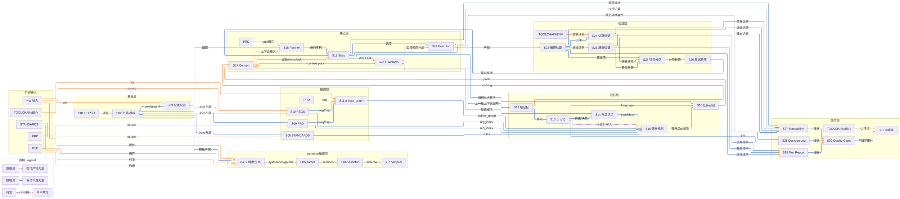

# EPI 开发切片总览（架构大图 + 任务切片）

> 目标：给出 EPI 本体开发的完整切片视图，支持整体评估与逐切片风险分析。

## 1. 总体开发大图（EPI 本体，不是 FW 业务架构）

```mermaid
%%{init: {"flowchart": {"defaultRenderer": "elk", "curve": "linear", "htmlLabels": false, "useMaxWidth": false}, "layoutOptions": {"elk.spacing.nodeNode": "8", "elk.layered.spacing.nodeNodeBetweenLayers": "14", "elk.spacing.edgeNode": "7", "elk.spacing.edgeEdge": "6", "elk.layered.nodePlacement.strategy": "BRUTE_LIST", "elk.layered.compaction.postCompaction": "true", "elk.layered.compaction.postCompaction.constraints": "NODE_DISTANCE COMPONENT_SIZES", "elk.layered.mergeEdges": "true", "elk.edgeRouting": "ORTHOGONAL", "elk.compactParts": "true", "elk.padding": "[top=14,left=6,bottom=8,right=6]"}, "themeVariables": {"fontSize": "24px"}}}%%
%% 方向写在下面的 flowchart 语句里，不写在 elk.direction：Mermaid 的 ELK 集成用图声明
%% 的方向去设 elk.direction，在 layoutOptions 里写会被静默覆盖（试过一次，无变化）。
%% 分散用后紧凑治，不用间距和宽高比治：间距是等比缩放，改多少比例还是那个形状。
%%   elk.layered.compaction.postCompaction   布局完成后整体收紧，专治分层布局的空档
%%   elk.layered.mergeEdges                  平行边合并，少占走边通道 -> 列更窄
%% 方向保持 LR（流水线语义）。
%% 字号是唯一的逐框收窄杠杆：框宽 = 标签文字宽 + 内边距，文字宽正比字号。
%% 字号当前 12px；再小会影响可读性，再窄就应拆图或减秩。
%% 反过来，CSS 强行改 .node rect 的 width 会错位：文字位置与边端点按 Mermaid 自测尺寸算。
%% 布局引擎用 ELK，不用默认 dagre。理由：dagre 把每个节点推到 max(前驱)+1，链一长整层横向散开，
%% 而且层框只是成员外接框、无任何旋钮。ELK 给了 dagre 没有的三个：
%%   elk.spacing.nodeNode                        同层节点间距（dagre 的 nodeSpacing 更粗）
%%   elk.layered.spacing.nodeNodeBetweenLayers   层间距（dagre 的 rankSpacing）
%%   elk.padding                                 层框内边距 —— dagre 完全没有这一项
%%   elk.layered.nodePlacement.strategy          BRUTE_LIST 比默认 SIMPLE 排得紧
%%   elk.compactParts                            多个连通分量紧凑打包，不再各占一片
%%   elk.edgeRouting                                 正交走边（横平竖直）：这是选定的风格，
%%                                                   显式写死，不靠 ELK 默认值恰好如此
%% 若渲染器版本不支持 ELK 会直接报错，此时删掉 defaultRenderer 与 layoutOptions 即回到 dagre。
flowchart LR

  %% ── 图例（不参与数据流，配色见文件末尾样式块）──
  %% @legend Legend   声明式排除：转换工具据此跳过图例子图
  %% 判据只有一问：这条边搬的是内容，还是决策？
  subgraph Legend[图例 Legend]
    direction LR
    LGS[数据流] --> LGE[交付产物为主]
    LRS[控制流] -.-> LRE[驱动下游为主]
    LPU[待定] -.->| ？示例 | LPE[尚未裁定]
  end
  style Legend fill:#FFFFFF,stroke:#94A3B8,stroke-width:1.2px,stroke-dasharray:4 3

  subgraph Inputs[外部输入]
    IN_PRD[PRD]
    IN_BSP[BSP]
    IN_HW[HW 输入]
    IN_STD[STANDARDS]
    IN_TOOL[TOOLCHAIN/ENV]
  end

  subgraph Foundation[基础层]
    direction TB
    S01[S01 CLI入口]
    S02[S02 布局/模板]
    S03[S03 配置校验]
  end

  subgraph Schema[Schema/编译层]
    S04[S04 SD模板生成]
    S05[S05 parser]
    S06[S06 validator]
    S07[S07 compiler]
  end

  subgraph Knowledge[知识层]
    %% @alias IN_PRD_K = IN_PRD
    IN_PRD_K[PRD]
    S08[S08 STANDARDS]
    S09[S09 PRD]
    S10[S10 REGS]
    S11[S11 artifact_graph]
  end

  subgraph Memory[记忆层]
    direction TB
    S12[S12 短记忆]
    S13[S13 长记忆]
    S14[S14 候选记忆]
    S15[S15 晋升规则]
    S16[S16 任务召回]
  end

  subgraph AgentCore[核心层]
    %% @alias IN_PRD_A = IN_PRD
    IN_PRD_A[PRD]
    S17[S17 Context]
    S18[S18 Planner]
    S19[S19 State]
    S20[S20 LLM/Tools]
    S21[S21 Executor]
  end

  subgraph Verify[验证层]
    direction TB
    %% @alias IN_TOOL_V = IN_TOOL
    IN_TOOL_V[TOOLCHAIN/ENV]
    S22[S22 编译验证]
    S23[S23 静态验证]
    S24[S24 仿真验证]
    S25[S25 错误分类]
    S26[S26 重试策略]
  end

  subgraph Delivery[交付层]
    direction TB
    %% @alias IN_TOOL_D = IN_TOOL
    IN_TOOL_D[TOOLCHAIN/ENV]
    S27[S27 Traceability]
    S28[S28 Decision Log]
    S29[S29 Test Report]
    S30[S30 Quality Gates]
    S31[S31 CI矩阵]
  end

  %% 数据流（橙实线，箭头 -->）：这条边存在的理由是交付产物
  S01 -.-> | 调用| S02
  S02 -.-> | config.yaml| S03
  S02 -.-> | 模板骨架| S04
  S04 -.-> | system-design.md| S05
  S05 -.-> | sections| S06
  S06 -.-> | schema| S07

  S02 -.-> | Docs布局| S08
  S02 -.-> | Docs布局| S09
  S02 -.-> | Docs布局| S10
  S09 -.-> | req节点| S11
  S10 -.-> | reg节点| S11

  S12 -.-> | 片段| S13
  S13 -.-> | 约束/决策| S14
  S08 -.-> | rules| S15
  S09 -.-> | req_index| S15
  S10 -.-> | reg_index| S15
  S11 -.-> | artifact_graph| S15
  S14 -.-> | candidate| S15
  S13 --> | long base| S16
  S15 -.-> | 晋升后的规则| S16
  S12 --> | working| S17
  S16 --> | pack| S17


  S03 -.-> | 配置| S18
  S18 -.-> | 任务序列| S19
  S19 -.-> | 调用 LLM| S20
  S19 -.-> | 调度| S21
  S21 -.-> | 产物| S22
  S22 -.-> | 编译结果| S23
  S22 -.-> | 工件| S24
  S22 -.-> | 错误流| S25
  S23 -.-> | 静态告警| S25
  S24 -.-> | 仿真结果| S25
  S25 -.-> | 分类标签| S26

  S19 -.-> | 追踪规格| S27
  S13 -.-> | 决策| S28
  S22 -.-> | 编译结果| S29
  S23 -.-> | 静态结果| S29
  S24 -.-> | 仿真结果| S29
  S27 -.-> | 证据| S30
  S28 -.-> | 证据| S30
  S29 -.-> | 证据| S30
  S30 -.-> | 判定门控| S31

  %% 运行时控制（控制流：蓝实线，箭头写 -.->）
  S17 -.-> | 上一轮上下文回写| S12
  S15 -.-> | ？晋升写入| S13
  S20 -.-> | 候选提名| S14
  S19 -.-> | 当前task查询| S16
  S19 --> | 当前phase/task| S17
  S17 --> | 上下文输入| S18
  S26 -.-> | 重试反馈| S19
  S17 --> | context pack| S20
  S20 -.-> | 工具调用计划| S21
  S21 -.-> | 执行记录| S27
  S22 -.-> | 编译记录| S27
  S23 -.-> | 静态记录| S27
  S24 -.-> | 仿真记录| S27
  S19 -.-> | 状态转移事件| S28

  IN_TOOL -->| env| S03
  IN_PRD -->| 约束| S04
  IN_BSP -->| 边界| S04
  IN_HW -->| 硬件| S04
  IN_STD -->| 标准| S04
  IN_STD -->| source| S08
  IN_PRD -->| source| S09
  IN_HW -->| source| S10
  IN_PRD_K -->| req| S11
  IN_HW -->| reg| S11
  IN_PRD_A -->| task语义| S18
  IN_TOOL_V -->| 仿真环境| S24
  IN_TOOL_D -->| CI环境| S31

  %% 样式：颜色由 tools/apply_edge_style.py 依 graph-rules.json 生成，勿手改
  %% 类别只由箭头写法决定（--> 数据流，-.-> 控制流，-.->且标签含 ？ 待定），配色是输出不是输入
  linkStyle default stroke:#F97316,stroke-width:2.2px
  linkStyle 0 stroke:#F97316,stroke-width:2.2px,stroke-dasharray:0
  linkStyle 1 stroke:#2563EB,stroke-width:2.2px,stroke-dasharray:0
  linkStyle 2 stroke:#A855F7,stroke-width:3.2px,stroke-dasharray:6 3
  linkStyle 3 stroke:#2563EB,stroke-width:2.2px,stroke-dasharray:0
  linkStyle 4 stroke:#2563EB,stroke-width:2.2px,stroke-dasharray:0
  linkStyle 5 stroke:#2563EB,stroke-width:2.2px,stroke-dasharray:0
  linkStyle 6 stroke:#2563EB,stroke-width:2.2px,stroke-dasharray:0
  linkStyle 7 stroke:#2563EB,stroke-width:2.2px,stroke-dasharray:0
  linkStyle 8 stroke:#2563EB,stroke-width:2.2px,stroke-dasharray:0
  linkStyle 9 stroke:#2563EB,stroke-width:2.2px,stroke-dasharray:0
  linkStyle 10 stroke:#2563EB,stroke-width:2.2px,stroke-dasharray:0
  linkStyle 11 stroke:#2563EB,stroke-width:2.2px,stroke-dasharray:0
  linkStyle 12 stroke:#2563EB,stroke-width:2.2px,stroke-dasharray:0
  linkStyle 13 stroke:#2563EB,stroke-width:2.2px,stroke-dasharray:0
  linkStyle 14 stroke:#2563EB,stroke-width:2.2px,stroke-dasharray:0
  linkStyle 15 stroke:#2563EB,stroke-width:2.2px,stroke-dasharray:0
  linkStyle 16 stroke:#2563EB,stroke-width:2.2px,stroke-dasharray:0
  linkStyle 17 stroke:#2563EB,stroke-width:2.2px,stroke-dasharray:0
  linkStyle 18 stroke:#2563EB,stroke-width:2.2px,stroke-dasharray:0
  linkStyle 19 stroke:#2563EB,stroke-width:2.2px,stroke-dasharray:0
  linkStyle 20 stroke:#2563EB,stroke-width:2.2px,stroke-dasharray:0
  linkStyle 21 stroke:#F97316,stroke-width:2.2px,stroke-dasharray:0
  linkStyle 22 stroke:#2563EB,stroke-width:2.2px,stroke-dasharray:0
  linkStyle 23 stroke:#F97316,stroke-width:2.2px,stroke-dasharray:0
  linkStyle 24 stroke:#F97316,stroke-width:2.2px,stroke-dasharray:0
  linkStyle 25 stroke:#2563EB,stroke-width:2.2px,stroke-dasharray:0
  linkStyle 26 stroke:#2563EB,stroke-width:2.2px,stroke-dasharray:0
  linkStyle 27 stroke:#2563EB,stroke-width:2.2px,stroke-dasharray:0
  linkStyle 28 stroke:#2563EB,stroke-width:2.2px,stroke-dasharray:0
  linkStyle 29 stroke:#2563EB,stroke-width:2.2px,stroke-dasharray:0
  linkStyle 30 stroke:#2563EB,stroke-width:2.2px,stroke-dasharray:0
  linkStyle 31 stroke:#2563EB,stroke-width:2.2px,stroke-dasharray:0
  linkStyle 32 stroke:#2563EB,stroke-width:2.2px,stroke-dasharray:0
  linkStyle 33 stroke:#2563EB,stroke-width:2.2px,stroke-dasharray:0
  linkStyle 34 stroke:#2563EB,stroke-width:2.2px,stroke-dasharray:0
  linkStyle 35 stroke:#2563EB,stroke-width:2.2px,stroke-dasharray:0
  linkStyle 36 stroke:#2563EB,stroke-width:2.2px,stroke-dasharray:0
  linkStyle 37 stroke:#2563EB,stroke-width:2.2px,stroke-dasharray:0
  linkStyle 38 stroke:#2563EB,stroke-width:2.2px,stroke-dasharray:0
  linkStyle 39 stroke:#2563EB,stroke-width:2.2px,stroke-dasharray:0
  linkStyle 40 stroke:#2563EB,stroke-width:2.2px,stroke-dasharray:0
  linkStyle 41 stroke:#2563EB,stroke-width:2.2px,stroke-dasharray:0
  linkStyle 42 stroke:#2563EB,stroke-width:2.2px,stroke-dasharray:0
  linkStyle 43 stroke:#2563EB,stroke-width:2.2px,stroke-dasharray:0
  linkStyle 44 stroke:#2563EB,stroke-width:2.2px,stroke-dasharray:0
  linkStyle 45 stroke:#2563EB,stroke-width:2.2px,stroke-dasharray:0
  linkStyle 46 stroke:#A855F7,stroke-width:3.2px,stroke-dasharray:6 3
  linkStyle 47 stroke:#2563EB,stroke-width:2.2px,stroke-dasharray:0
  linkStyle 48 stroke:#2563EB,stroke-width:2.2px,stroke-dasharray:0
  linkStyle 49 stroke:#F97316,stroke-width:2.2px,stroke-dasharray:0
  linkStyle 50 stroke:#F97316,stroke-width:2.2px,stroke-dasharray:0
  linkStyle 51 stroke:#2563EB,stroke-width:2.2px,stroke-dasharray:0
  linkStyle 52 stroke:#F97316,stroke-width:2.2px,stroke-dasharray:0
  linkStyle 53 stroke:#2563EB,stroke-width:2.2px,stroke-dasharray:0
  linkStyle 54 stroke:#2563EB,stroke-width:2.2px,stroke-dasharray:0
  linkStyle 55 stroke:#2563EB,stroke-width:2.2px,stroke-dasharray:0
  linkStyle 56 stroke:#2563EB,stroke-width:2.2px,stroke-dasharray:0
  linkStyle 57 stroke:#2563EB,stroke-width:2.2px,stroke-dasharray:0
  linkStyle 58 stroke:#2563EB,stroke-width:2.2px,stroke-dasharray:0
  linkStyle 59 stroke:#F97316,stroke-width:2.2px,stroke-dasharray:0
  linkStyle 60 stroke:#F97316,stroke-width:2.2px,stroke-dasharray:0
  linkStyle 61 stroke:#F97316,stroke-width:2.2px,stroke-dasharray:0
  linkStyle 62 stroke:#F97316,stroke-width:2.2px,stroke-dasharray:0
  linkStyle 63 stroke:#F97316,stroke-width:2.2px,stroke-dasharray:0
  linkStyle 64 stroke:#F97316,stroke-width:2.2px,stroke-dasharray:0
  linkStyle 65 stroke:#F97316,stroke-width:2.2px,stroke-dasharray:0
  linkStyle 66 stroke:#F97316,stroke-width:2.2px,stroke-dasharray:0
  linkStyle 67 stroke:#F97316,stroke-width:2.2px,stroke-dasharray:0
  linkStyle 68 stroke:#F97316,stroke-width:2.2px,stroke-dasharray:0
  linkStyle 69 stroke:#F97316,stroke-width:2.2px,stroke-dasharray:0
  linkStyle 70 stroke:#F97316,stroke-width:2.2px,stroke-dasharray:0
  linkStyle 71 stroke:#F97316,stroke-width:2.2px,stroke-dasharray:0
```

### 1.1 边的图例

**类别由箭头写法决定，颜色只是把它画出来** —— 两者矛盾时工具直接报错，不会静默画出另一张图。

| 箭头写法 | 颜色 | 类 | 含义 |
|---|---|---|---|
| `-->` | 橙 `#F97316` 实线 | 数据流 | **纯搬内容**：这条边的全部理由是把内容交到下游手上 |
| `-.->` | 蓝 `#2563EB` 实线 | 工作流 | **驱动下游**：这条边存在的理由是让下游开始/改变做事 |
| `-.->` 且标签以 `？` 开头 | 紫 `#A855F7` **虚线** | 待定 | 主导性确实争不动，**勿据此推导任何东西** |

**判据为什么不是「搬内容还是搬决策」**：控制边必然携带数据（调谁、传什么、返回什么），那个问法对任何一条边都能自圆其说 —— 它不是二分。真正的判据是**主导性**：把数据成分去掉，这条边还有理由存在吗？

按这条判据，**绝大部分边是工作流**：阶段推进、调用、触发、反馈，都因「让下游开始做事」而存在。够格当数据流的只有**纯搬内容**的两类：

1. **外部输入注入** —— `IN_PRD / IN_BSP / IN_HW / IN_STD / IN_TOOL → 各切片`。外部资料不会「调用」谁
2. **提示词片段的走向** —— `S13 → S16`、`S12 → S17`、`S16 → S17`、`S17 → S20`。片段从记忆与召回流进装配器、再装进 LLM 请求，全程没有「该你了」的含义。**这条链必须是数据流，否则提示词内容的来源在图上断开**

标定例：**`S01 → S02` 是工作流** —— CLI 入口调用布局生成，「CLI 契约」只是调用参数。把它当数据流，就是把「每条边都带数据」误当成「每条边都是数据流」。

> 类别名用「工作流」与术语表冲突（那里工作流 = 端到端执行）。文档里提到边类别时一律写全「工作流边」，端到端执行一律写「工作流（端到端）」。是否给边类别改名（如「控制边」）待裁。
>
> 两个类别都是实线，靠颜色区分；**虚线现在只有一个意思：待定**。

当前 69 条边（不含图例）：数据流 20 / 工作流 48 / 待定 1。

### 1.2 开发顺序不在图里（也不再推导）

旧规则：**开发顺序 = 数据流图缩点后的拓扑序**。它建立在「数据流是主关系」上。按上面的判据重划后数据流只剩 20 条，**用它分层会把 31 个切片压进同一列，用它排序等于没有顺序** —— 推导作废。

| 关系 | 用途 | 在哪里 |
|---|---|---|
| **开发依赖** | 实现某片前必须完成哪片 | **WBS 表「开发依赖」列，人手写** |
| **分层 layering** | 只决定图上谁左谁右 | `graph-rules.json` 的 `layering.classes`，含全部三类，缩点破环 |
| **数据流** | 内容从哪来到哪去 | 语义类别，**不再参与排序** |

三者解耦是这次整改的结果，不是前提。以前它们共用「数据流」一个关系，于是一次语义重分类会静默改变开发顺序和图布局 —— 顺序随分类漂移，等于没有顺序。

数据流图当前**无环**（测试声明为空集）。agent 回路 `S17 → S18 → S19 → S17` 以前被声明为「合法数据环」，其实它是**控制回路**：只有携带内容的两条腿（`S19 → S17` 当前 phase、`S17 → S18` 上下文）是数据。`S18 → S19 任务序列` 归回工作流后环自然消失 —— **一个驱动的循环本就不该出现在数据流图里**。不变量因此变更强：现在出现任何数据环，都意味着有人把决策塞进了数据管道。

### 1.3 待定边（需架构裁定）

| 边 | 为什么两难 |
|---|---|
| `S15 ？晋升写入 S13` | 写入的是记录（数据），但「晋升」这个动作改变了后续能召回什么（控制） |

以前这里有 6 条。五条按主导性归位：`S17 → S12 回写`、`S15 → S16 改召回范围` 归工作流（改变下一步做谁）；`S17 → S20 context pack` 归数据流；`S19 → S27 追踪规格`、`S30 → S31 判定门控` 各自归位。**它们当初看起来不可判，是因为旧判据本身不是二分。**

### 1.4 工具链

图的可编辑表示只有 `.mmd`，其余全是派生产物。

| 命令 | 作用 |
|---|---|
| `python tools/apply_edge_style.py <mmd> <md>` | 按箭头规则重生成配色块，并把 `.mmd` 同步进 `.md`。幂等 |
| `python tools/gen_interactive_graph.py` | 生成可交互 HTML（`--check` 查过期，`--open` 直接打开） |
| `python tools/derive_dev_order.py` | 报告**图上分层**与数据环。**不再等于开发顺序**，开发顺序在 WBS 表里手写 |
| `python tools/sync_diagram_md.py <mmd> <md> --check` | 只检查 `.md` 内嵌图是否落后于 `.mmd` |
| `pytest tests/test_slices_overview.py tests/test_slices_graph.py` | 不变量守门 |

**语义规则集中在 `tools/graph-rules.json`**：颜色 ↔ 关系类别 ↔ 是否参与开发排序 ↔ 哪一列是节点功能描述。加一类关系或换描述列只改这个 JSON，代码不动。页面模板在 `tools/graph_template.html`。

改图流程：编辑 `.mmd` 的节点与箭头 → `apply_edge_style.py` → `gen_interactive_graph.py` → `pytest`。

### 1.5 交互图的聚焦语义

聚焦一个节点时，**只沿主关系（数据流）传递 N 跳**，构成以它为中心的 ego 网络；范围内的边全部显示，范围外一律不亮。工作流与待定边**不参与传递**，只在 ego 网络内部或与聚焦节点直连时出现。

原因：本图有一个 15 节点的强连通回路。若按“任意边可达”定义下游，`S26 → 重试反馈 → S19` 会把整个记忆子系统算成 S22 的下游，聚焦一个节点点亮大半张图 —— 那不是下游，是可达性爆炸。

节点说明框显示该片的**功能描述**（取自 WBS 表「目标产物」列）与验收标准；图例含义（箭头 ↔ 颜色）常驻右下角大图说明框，不随节点弹出。

---

## 2. 开发切片清单（WBS）

| Slice | 名称 | 目标产物 | 开发依赖 | 运行时依赖 | 验收标准（DoD） |
|---|---|---|---|---|---|
| S01 | CLI入口与命令模型 | `epi` 命令入口 | - | - | `epi /path`、`--schema-compile`、`--reset-schema-template` 可用 |
| S02 | 项目布局与模板生成 | Docs 目录树 + 模板文件 | S01 | - | 一键补齐目录；`--check-only` 正确报告 |
| S03 | 配置加载与校验 | `config` 模块 | S02, TOOLCHAIN/ENV 配置输入 | - | config 缺失/非法时给出明确错误 |
| S04 | SYSTEM-DESIGN 生成 | 完整 `system-design.md` | S02, PRD + BSP + HW(SCH/DATASHEET/REGS/PIN_MAP) + STANDARDS 输入约束 | - | 在模板基础上融合外部输入，生成可直接解析的完整设计MD |
| S05 | parser | section/kv/table/mermaid 解析 | S04（完整 `system-design.md`） | - | 仅读取 S04 输出MD并稳定解析固定结构 |
| S06 | validator | 严格规则校验 | S05 | - | section/表头不符即 fail |
| S07 | compiler | 编译输出 JSON | S06 | - | 输出 deterministic JSON |
| S08 | STANDARDS ingestion | `knowledge/rules.json` | S02, STANDARDS 文档输入 | - | 规则具备 source_id/source_path |
| S09 | PRD ingestion | `requirements_index.json` | S02, PRD 文档输入 | - | 需求具备 req_id/source |
| S10 | REGS ingestion | `register_index.json` | S02, HW REGS/DATASHEET 输入 | - | 寄存器条目可检索 |
| S11 | artifact_graph | `artifact_graph.json` | S09,S10, PRD + HW REGS 关联输入 | - | 可计算跨模块影响节点数 |
| S12 | 短记忆 | `working_memory.json` | - | S17（上一轮） | 每步刷新、体量受控 |
| S13 | 长记忆 | `long_memory.json` | S12 | S15（晋升写入） | decisions/constraints/traceability 三类齐全 |
| S14 | 候选记忆 | `candidate_memory.json` | S13 | S20（LLM提名输出） | 记录 LLM 提名候选 |
| S15 | 晋升规则引擎 | promotion 模块 | S08,S09,S10,S11,S14 | S14（候选输入） | 无白名单 source_id 不晋升 |
| S16 | 召回策略 | memory pack | S13,S15 | S19（当前task） | 按 task 返回最小记忆包 |
| S17 | ContextAssembler | 上下文组装器 | S12,S16 | S19（当前phase/task） | token 控量，按层注入 |
| S18 | TaskPlanner | 任务列表生成 | S03, PRD 输入 | S17（上下文输入） | PRD->任务有序可执行 |
| S19 | StateMachine | 主循环与状态流转 | S18 | S26（重试反馈） | phase/task/retry 行为可预测 |
| S20 | LLMClient+Tools | 模型与工具调用 | S19 | S17（上下文包） | provider 可替换 |
| S21 | Executor | 文件与动作执行 | S19 | S20（工具调用计划） | 写入动作可审计 |
| S22 | Compiler Verifier | 编译验证 | S21 | S21（执行产物输入） | fail 输出结构化错误 |
| S23 | Static Verifier | 静态分析 | S22 | S22（编译结果） | 规则告警可结构化 |
| S24 | Simulator Verifier | 仿真验证 | S22, TOOLCHAIN/ENV 运行输入 | S22（编译结果） | timeout/crash 可识别 |
| S25 | Error Classifier | 错误分类器 | S22,S23,S24 | S22,S23,S24（验证信号） | 分类准确映射恢复策略 |
| S26 | Retry Strategy | 重试策略引擎 | S25 | S25（分类结果） | 错误类型对应差异化重试 |
| S27 | Traceability 输出 | traceability 文档 | S19 | S21,S22,S23,S24（执行与验证记录） | req->code->test 全链路 |
| S28 | Decision Log 输出 | design_decisions 文档 | S13 | S19（状态转移事件） | 每个关键决策可追溯 |
| S29 | Test Report 输出 | test_report 文档 | S22,S23,S24 | S22,S23,S24（验证结果流） | 验证结果汇总完整 |
| S30 | Quality Gates | 门禁策略 | S27,S28,S29 | S29（实时门禁判定） | gate fail 阻断后续阶段 |
| S31 | CI矩阵 | Win/Linux CI | S30, TOOLCHAIN/ENV 矩阵输入 | S30（门禁结果） | 双平台流水线稳定 |

> 依赖说明：
> - **开发依赖**：实现该切片前必须完成的前置切片（对应图中**橙色实线**，即数据流）。
> - **运行时依赖**：执行阶段才产生的信息依赖（对应图中**蓝色实线**，即工作流）；若信息在执行前已知，则归入开发依赖。

---

## 3. 关键边界（防跑偏）

1. **FW Architecture ≠ EPI Development Architecture**
   - FW 架构图是业务输出。
   - 本文是 EPI 自身开发任务图。

2. **driver 初始化边界**
   - 不属于 `fw-architecture` 描述域。
   - 唯一来源：`Docs/ai-generation/register-init/*`。

3. **语义不做最终裁决**
   - LLM 可提名，不可直接晋升长记忆。
   - 最终由规则引擎按结构化证据判定。
